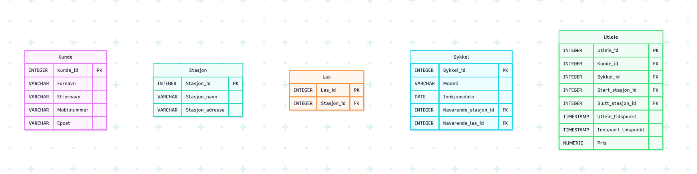
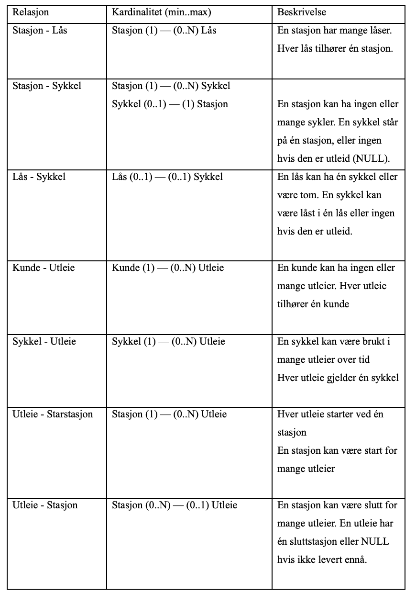
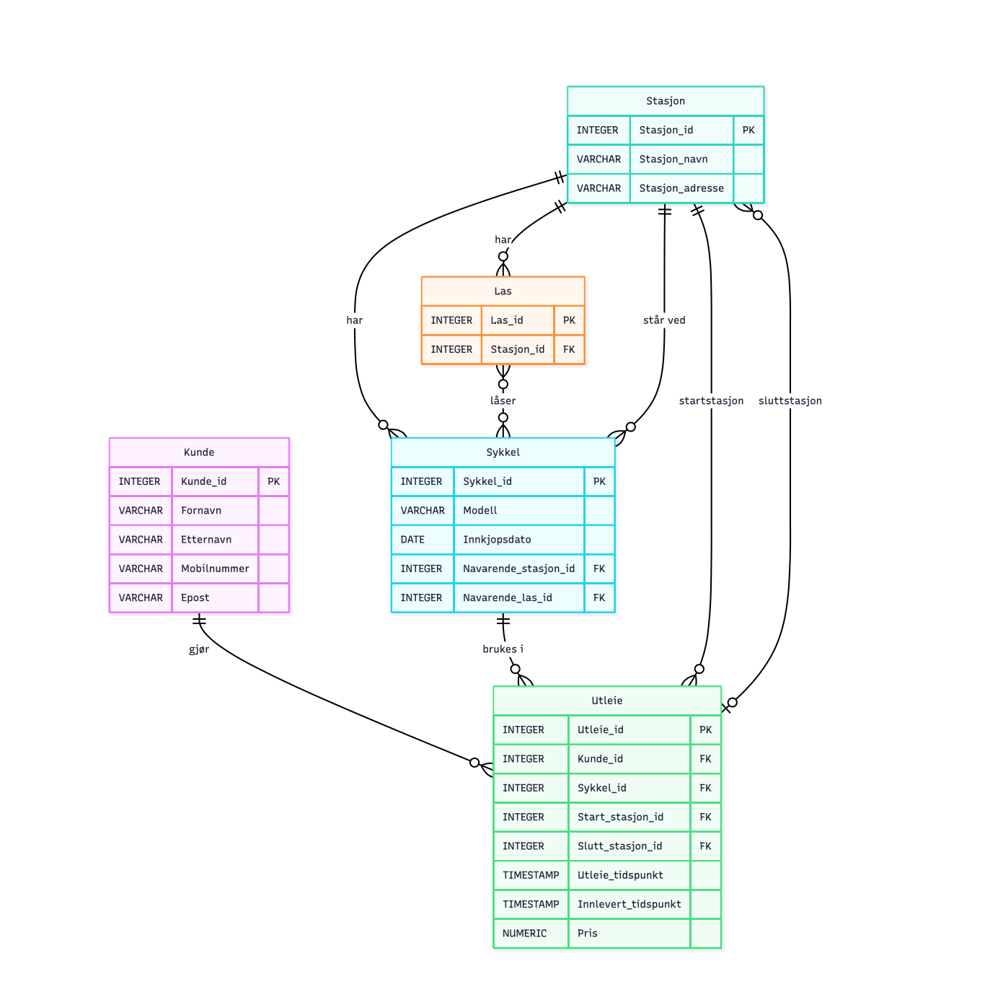
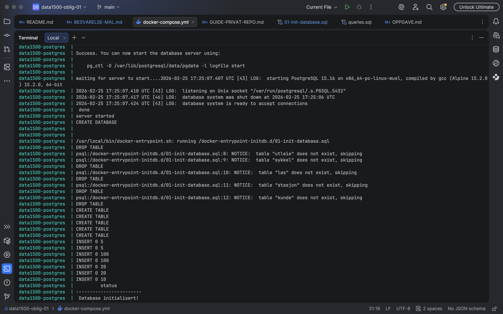
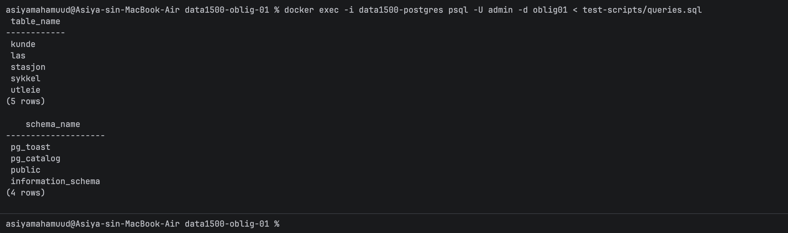

# Besvarelse - Refleksjon og Analyse

**Student:** Asiya Abdilahi Mahamuud

**Studentnummer:** 345335

**Dato:** 01.03.2026

---

## Del 1: Datamodellering

### Oppgave 1.1: Entiteter og attributter

**Identifiserte entiteter:**


1.	Kunder 

Kunde er en sentral entitet fordi hele systemet dreier seg om hvilke kunder som leier sykler.

2. Sykkelstasjoner/Stasjoner

Fysiske lokasjoner for utleie.
Hver stasjon må kunne identifiseres og knyttes til syklene og låsene som befinner seg der. 


3. Låser

Systemet må vite hvor mange ledige låser det finnes på en stasjon (for at brukere skal kunne levere sykkel). 
Dette krever en egen entitet for låser.


4.	Sykler

Sykkelen er hoved objektet i utleieforholdet. Den må kunne knyttes til stasjon og lås for drift, men også nullstilles ved utleie for å indikere at den ikke er tilgjengelig.


5.	Utleie

Utleie er en relasjonsentitet mellom Kunde og Sykkel. 


**Attributter for hver entitet:**


1. Attributter for Kunder:

-	Kunde_id (PK)

Unik identifikator for hver kunde. Brukes til å koble kunder til utleier.

-	Fornavn
-	Etternavn

Fornavn og etternavn er naturlige egenskaper ved kunden. Beholdes separat for enklere sortering og visning.

-	Mobilnummer

Trengs for innlogging og identifikasjon.

-	Epost

Brukes til kommunikasjon og kvitteringer.


2. Attributter for Sykkelstasjoner:

-	Stasjon_id (PK)

 Unik identifikator for stasjonen.

-	Stasjon_adresse

-	Stasjon_navn

Viktig for lokasjon.


3. Attributter for Låser:

-	Lås_id (PK)

Unik for hver fysiske lås.

-	Stasjon_id (FK → Sykkelstasjon)

Knytter låsen til stasjonen.


4. Attributter for Sykler:

-	Sykkel_id (PK)
    
Unik ID for hver sykkel (fysisk eiendel).

-	Modell

Beskrivelse av type el‑sykkel, bysykkel osv.

-	Innkjøpsdato

Brukes til vedlikeholds‑ og strukturkostanalyser.

-	Nåværende_stasjon_id (FK → Sykkelstasjon, kan være NULL)

Angir hvor sykkelen står når den ikke er utleid.

-	Nåværende_lås_id (FK → Lås, kan være NULL)
     
Angir hvilken lås sykkelen står i. NULL når sykkelen er utleid.


5. Attributter for Utleie:

-	Utleie_id (PK)

Primærnøkkel for unikt utleieforhold.

-	Kunde_id (FK → Kunder)

Hvem som leier sykkelen.

-	Sykkel_id (FK → Sykler)

Hvilken sykkel som leies.

-	Start_stasjon_id (FK → Sykkelstasjon)

Hvor sykkelen ble hentet.

-	Slutt_stasjon_id (FK → Sykkelstasjon, NULL hvis ikke levert)

Hvor sykkelen ble levert.

-	Utleie_tidspunkt

Når leien startet.

-	Innlevert_tidspunkt (kan være NULL)

Når leien avsluttes. NULL = ikke levert.


---

### Oppgave 1.2: Datatyper og `CHECK`-constraints

**Valgte datatyper og begrunnelser:**

1. Kunder

•	Kunde_id (PK) – INTEGER

Begrunnelse: Heltall-ID som gir en unik identifikator til hver kunde.

•	Fornavn – VARCHAR(50)

Begrunnelse: Variabel tekst med moderat lengde.

•	Etternavn – VARCHAR(50)

Begrunnelse: Variabel tekst som muliggjør sortering og søk.

•	Mobilnummer – VARCHAR(15)

Begrunnelse: Variabel tekst for å inkludere landskode og sikre fleksibilitet.

•	Epost – VARCHAR(100)

Begrunnelse: Variabel tekst.


2. Sykkelstasjoner

•	Stasjon_id (PK) – INTEGER

Begrunnelse: Heltall-ID som unikt identifiserer hver stasjon.

•	Stasjon_navn – VARCHAR(100)

Begrunnelse: Variabel tekst som beskriver stasjonsnavnet.

•	Stasjon_adresse – VARCHAR(200)

Begrunnelse: Variabel tekst for å lagre adressen til stasjonen.


3. Sykler

•	Sykkel_id (PK) – INTEGER

Begrunnelse: Heltall-ID som unikt identifiserer hver sykkel.

•	Modell – VARCHAR(100)

Begrunnelse: Variabel tekst for sykkelens modelltype.

•	Innkjøpsdato – DATE

Begrunnelse: Dato som viser når sykkelen ble anskaffet.

•	Nåværende_stasjon_id (FK) – INTEGER

Begrunnelse: Heltall-ID som refererer til tilhørende sykkelstasjon.

•	Nåværende_lås_id (FK) – INTEGER

Begrunnelse: Heltall-ID som refererer til låsen sykkelen står i.

•	


4. Låser

•	Lås_id (PK) – INTEGER

Begrunnelse: Heltall-ID som identifiserer hver enkelt lås.

•	Stasjon_id (FK) – INTEGER

Begrunnelse: Heltall-ID som knytter låsen til en stasjon.


5. Utleie

•	Utleie_id (PK) – INTEGER

Begrunnelse: Heltall-ID som unikt identifiserer hvert utleieforhold.

•	Kunde_id (FK) – INTEGER

Begrunnelse: Heltall-ID som kobler utleien til riktig kunde.

•	Sykkel_id (FK) – INTEGER

Begrunnelse: Heltall-ID som kobler utleien til sykkelen som ble leid.

•	Start_stasjon_id (FK) – INTEGER

Begrunnelse: Heltall-ID som viser hvor sykkelen ble hentet.

•	Slutt_stasjon_id (FK, NULL) – INTEGER

Begrunnelse: Heltall-ID som viser hvor sykkelen ble levert; kan være NULL dersom den ikke er levert.

•	Utleie_tidspunkt – TIMESTAMP

Begrunnelse: Lagrer både dato og klokkeslett for når utleien startet.

•	Innlevert_tidspunkt – TIMESTAMP

Begrunnelse: Lagrer både dato og klokkeslett for når utleien ble avsluttet.

•	Pris – NUMERIC(8,2)

Begrunnelse: Nøyaktig numerisk datatype for valutabeløp, slik at priser lagres uten avrundingsfeil.


**`CHECK`-constraints:**

Check – constraints:

Mobilnummer:

CONSTRAINT mobilnummer_regel
CHECK (Mobilnummer ~ '^[0-9]{8}$')

Sikrer at mobilnummer kun består av 8 tall og hindrer feilregistrering.

Epost:

CONSTRAINT epost_regel
CHECK (Epost LIKE '%@%.%')

Sikrer at epost har gyldig struktur på et grunnleggende nivå.


Pris:

CONSTRAINT pris_regel
CHECK (Pris >= 0)

Leiebeløpet kan ikke være negativt.


**ER-diagram:**

ER - diagram som viser entitetene og attributtene med datatyper - lager med mermaid.live:


- Dette ER - diagrammet inneheholder også primærnøkler som fremmednøkler. :)


---

### Oppgave 1.3: Primærnøkler

**Valgte primærnøkler og begrunnelser:**

Primærnøkkel: Kunde_id

Jeg har valgt Kunde_id som primærnøkkel fordi den er en unik identifikator for hver kunde.

Primærnøkkel: Stasjon_id

Stasjon_id er valgt som primærnøkkel fordi hver stasjon må kunne identifiseres entydig.
Navn eller adresse kan i teorien være like eller endres, derfor brukes en egen numerisk ID for å sikre unik identifikasjon og stabile koblinger til andre tabeller.

Primærnøkkel: Sykkel_id

Hver sykkel har en unik ID i systemet. Sykkel_id brukes som primærnøkkel fordi den identifiserer en spesifikk fysisk sykkel. Modell eller innkjøpsdato er ikke unike og kan ikke brukes som identifikator.

Primærnøkkel: Lås_id

Lås_id er valgt som primærnøkkel fordi hver lås ved en stasjon må kunne identifiseres separat. En stasjon har flere låser, derfor kan ikke Stasjon_id alene brukes som identifikator.

Primærnøkkel: Utleie_id

Utleie_id identifiserer hver enkelt leieperiode. En kunde kan leie flere ganger, og en sykkel kan leies flere ganger over tid. Derfor trengs en egen unik ID for hver utleie for å skille mellom ulike leieforhold.


**Naturlige vs. surrogatnøkler:**

I denne modellen har jeg valgt å bruke egne ID-attributter (for eksempel Kunde_id og Utleie_id) som primærnøkler.
Det finnes enkelte naturlige kandidater, som mobilnummer eller epost for Kunde, men disse kan endres over tid og er derfor ikke stabile nok som primærnøkkel.
Derfor har jeg valgt å bruke systemgenererte ID-er som gir enkle, stabile og entydige identifikatorer for hver entitet.


**Oppdatert ER-diagram:**

Mermaid.live:




### Oppgave 1.4: Forhold og fremmednøkler

**Identifiserte forhold og kardinalitet:**

Skjermbildet av tabell med forhold og kardinalitet som jeg har laget:




**Fremmednøkler:**


•	Lås.stasjon_id refererer til primærnøkkelen i Stasjon. Dette gjør at hver lås må være knyttet til én eksisterende stasjon, og implementerer 1:N-forholdet mellom stasjon og lås.

•	Sykkel.stasjon_id refererer til Stasjon. Denne kan være NULL når sykkelen er utleid. Dette implementerer forholdet der en sykkel normalt står på én stasjon, men kan være uten stasjon under aktiv utleie.

•	Sykkel.lås_id refererer til Lås og kan være NULL. Dette gjør at en sykkel kan være låst i én lås, eller ingen hvis den er utleid.

•	Utleie.kunde_id refererer til Kunde. Dette sikrer at hver utleie alltid er knyttet til én registrert kunde.

•	Utleie.sykkel_id refererer til Sykkel. Dette gjør at hver utleie gjelder én bestemt sykkel, og at en sykkel kan forekomme i flere utleier over tid.

•	Utleie.start_stasjon_id refererer til Stasjon og sikrer at hver utleie starter ved en gyldig stasjon.

•	Utleie.slutt_stasjon_id refererer til Stasjon og kan være NULL frem til sykkelen leveres. Dette gjør det mulig å registrere både pågående og avsluttede utleier.


**Oppdatert ER-diagram:**

mermaid.live:



---

### Oppgave 1.5: Normalisering

**Vurdering av 1. normalform (1NF):**

En tabell er i 1. normalform (1NF) dersom:

•	Alle attributter inneholder atomiske (enkle) verdier

•	Det ikke finnes gjentakende grupper

•	Hver rad kan identifiseres entydig ved hjelp av en primærnøkkel

I min modell oppfyller alle tabeller disse kravene:

•	Hver tabell har en definert primærnøkkel (f.eks. Kunde_id, Sykkel_id, Utleie_id).
• Alle attributter inneholder én verdi per celle (f.eks. ett mobilnummer, én dato, én pris).

•	Jeg har ikke lagret flere verdier i samme felt (for eksempel flere mobilnumre i én kolonne).

•	Jeg har heller ikke lagt utleier direkte inn i Kunde-tabellen som en liste  i stedet har jeg opprettet en egen Utleie-tabell.
Dette betyr at datamodellen min tilfredsstiller 1NF.


**Vurdering av 2. normalform (2NF):**

En tabell er i 2. normalform (2NF) dersom:

•	Den allerede er i 1NF

•	Alle ikke-nøkkelattributter er fullstendig funksjonelt avhengige av hele primærnøkkelen

2NF er spesielt relevant når man har sammensatte primærnøkler (flere kolonner som sammen utgjør PK).

I min modell har jeg valgt å bruke én enkel primærnøkkel i hver tabell (for eksempel Utleie_id i Utleie). Det betyr at det ikke finnes sammensatte primærnøkler.

Dermed kan det heller ikke oppstå delvis avhengighet (der et attributt bare avhenger av deler av primærnøkkelen).

Alle attributter i hver tabell avhenger av hele primærnøkkelen:

•	I Kunde avhenger fornavn, etternavn, mobilnummer og epost av Kunde_id.

•	I Sykkel avhenger modell og innkjøpsdato av Sykkel_id.

•	I Utleie avhenger tidspunkt og pris av Utleie_id.

Dette betyr at modellen oppfyller 2NF.


**Vurdering av 3. normalform (3NF):**

En tabell er i 3. normalform (3NF) dersom:

•	Den er i 2NF

•	Ingen ikke-nøkkelattributter er avhengige av andre ikke-nøkkelattributter (ingen transitive avhengigheter)

I min modell finnes det ingen transitive avhengigheter:

•	I Kunde-tabellen avhenger ikke epost av mobilnummer eller omvendt, begge avhenger kun av Kunde_id.

•	I Sykkel-tabellen avhenger ikke modell av innkjøpsdato eller stasjon, alt avhenger direkte av Sykkel_id.

•	I Utleie-tabellen avhenger ikke pris av start_stasjon_id eller kunde_id, alle attributter er knyttet direkte til Utleie_id.

Jeg har også unngått å lagre stasjonsnavn inne i Utleie-tabellen. I stedet bruker jeg fremmednøkkel (start_stasjon_id og slutt_stasjon_id) som peker til Stasjon-tabellen. Dette forhindrer duplisering av stasjonsdata og


**Eventuelle justeringer:**

Jeg har ikke hatt behov for å gjøre justeringer for å oppnå 3NF, fordi:

•	Jeg har delt opp entiteter logisk (Kunde, Sykkel, Lås, Stasjon, Utleie).

•	Jeg har brukt fremmednøkler i stedet for å duplisere informasjon.

•	Jeg har brukt egne ID-er (surrogatnøkler), noe som forenkler normalisering.

Datamodellen min er derfor strukturert slik at den reduserer redundans og minimerer risikoen for oppdateringsanomalier (for eksempel inkonsistente stasjonsnavn eller dupliserte kundedata).


---

## Del 2: Database-implementering

### Oppgave 2.1: SQL-skript for database-initialisering

**Plassering av SQL-skript:**

Jeg bekrefter at jeg har lagt SQL-skriptet i `init-scripts/01-init-database.sql`. :)

**Antall testdata:**

- Kunder: 5
- Sykler: 100
- Sykkelstasjoner: 5
- Låser: 100 låser (20 per stasjon)
- Utleier: 50

---

### Oppgave 2.2: Kjøre initialiseringsskriptet

**Dokumentasjon av vellykket kjøring:**

Databas initialisert!:



**Spørring mot systemkatalogen:**

```sql
SELECT table_name 
FROM information_schema.tables 
WHERE table_schema = 'public' 
  AND table_type = 'BASE TABLE'
ORDER BY table_name;
```

**Resultat:**

Skjermbildet av output:


table_name
------------
kunde,
las,
stasjon,
sykkel,
utleie,
(5 rows)

---

## Del 3: Tilgangskontroll

### Oppgave 3.1: Roller og brukere

**SQL for å opprette rolle:**

```sql
CREATE ROLE kunde;
```

**SQL for å opprette bruker:**

```sql
CREATE USER kunde_1 WITH PASSWORD 'kunde123';
```

**SQL for å tildele rettigheter:**

```sql
GRANT kunde TO kunde_1;
```

**Gir lesetilgang til kunde-rollen**

```sql
GRANT SELECT ON Kunde TO kunde;
GRANT SELECT ON Stasjon TO kunde;
GRANT SELECT ON Sykkel TO kunde;
GRANT SELECT ON Utleie TO kunde;
```


---

### Oppgave 3.2: Begrenset visning for kunder

**SQL for VIEW:**

```sql
CREATE VIEW mine_utleier AS
SELECT *
FROM Utleie
WHERE Kunde_id = 1;
```
Feks hvis kunde_1 skal representere kunde_id = 1.


**Gir kunde-rollen lesetilgang på view-en:**
```sql
GRANT SELECT ON mine_utleier TO kunde;
```
**Ulempe med VIEW vs. POLICIES:**

En ulempe med å bruke VIEW for autorisasjon er at selve begrensningen ikke ligger direkte i tabellen, men i visingen. Hvis en bruker på en eller annen måte får
tilgang til den underliggende tabellen, kan man i praksis omgå viewet og se mer data enn man egentlig skal. Med POLICY legges reglene direkte på tabellen, slik at databsen
selv sørger for brukere bare får se de radene de har tilgang til. Det gjør løsningen mer robust og vanskeligere å ommgå.

---

## Del 4: Analyse og Refleksjon

### Oppgave 4.1: Lagringskapasitet

**Gitte tall for utleierate:**

- Høysesong (mai-september): 20000 utleier/måned
- Mellomsesong (mars, april, oktober, november): 5000 utleier/måned
- Lavsesong (desember-februar): 500 utleier/måned

**Totalt antall utleier per år:**

Høysesong (5 måneder: mai–september):

20000 utleier × 5 måneder
= 100 000 utleier

Mellomsesong (4 måneder: mars, april, oktober, november):

5000 utleier × 4 måneder
= 20 000 utleier

Lavsesong (3 måneder: desember–februar):

500 utleier × 3 måneder
= 1 500 utleier

Totalt per år:

100 000 + 20 000 + 1 500
= 121 500 utleier per år


**Estimat for lagringskapasitet:**


Omtrentlige størrelser (typisk PostgreSQL):

- INTEGER ≈ 4 byte 
- DATE ≈ 4 byte 
- TIMESTAMP ≈ 8 byte 
- NUMERIC ≈ 8 byte 
- VARCHAR (snitt) ≈ 20–50 byte


Radstørrelse per tabell (estimat):

Kunde: 4 + 20 + 20 + 15 + 30 = 90 bytes

Stasjon: 4 + 30 + 50 = 85 bytes

Las: 4 + 4 = 8 bytes

Sykkel: 4 + 30 + 4 + 4 + 4 = 46 bytes

Utleie: 4 + 4 + 4 + 4 + 4 + 8 + 8 + 8 = 44 bytes


**Totalt for første år:**

Utleie dominerer fullstendig: 121 500 × 44 ≈ 5,1 MB
De øvrige tabellene er ubetydelige i størrelse.

Totalt ≈ 5–6 MB


---

### Oppgave 4.2: Flat fil vs. relasjonsdatabase

**Analyse av CSV-filen (`data/utleier.csv`):**

**Problem 1: Redundans**

Redundans betyr at samme informasjon lagres flere ganger.
I CSV-filen ser vi flere eksempler:

Eksempel – Kundeinformasjon gjentas

Ole Hansen forekommer tre ganger:
Ole,Hansen,+4791234567,ole.hansen@example.com

Kari Olsen forekommer tre ganger:
Kari,Olsen,+4792345678,kari.olsen@example.com

Den samme informasjonen (navn, mobilnummer, epost) lagres på nytt for hver utleie. 
Dette er unødvendig lagring av samme data.


**Problem 2: Inkonsistens**

Inkonsistens oppstår når samme informasjon kan lagres forskjellig. Fordi data gjentas, kan små skrivefeil skape problemer.

Eksempel:

Hvis en rad skriver: Blindern Oslo, og en annen rad skriver: Blinders Oslo. Vil databasen tro at dette er to forskjellige stasjoner.
Det samme gjelder for navn, mobilnummer, og epost.

**Problem 3: Oppdateringsanomalier**

Hvis vi sletter Oles siste utleie, mister vi også all informasjon om Ole som kunde. Vi mister kundeinformasjon selv om vi kanskje ønsker å beholde den.

Hvis Ole Hansen bytter e-postadresse, må vi oppdatere ALLE rader hvor han forekommer. Hvis vi glemmer en rad → inkonsistente data.

Vi kan ikke legge inn en ny kunde før kunden har gjort en utleie. Vi kan ikke registrere en ny stasjon uten at noen har brukt den i en utleie. Flat struktur gjør systemet lite fleksibelt. Redundans øker risikoen for inkonsistente data.

I en relasjonsdatabase deles dette opp i: Kunde, Sykkel, Stasjon, Utleie. Da lagres hver informasjon kun én gang. Dette kalles normalisering.

**Fordeler med en indeks:**

Anta spørringen: 

SELECT * FROM utleie WHERE sykkel_id = 5;

Uten indeks:

Databasen må:
1.	Lese hele tabellen
2.	Sammenligne hver rad
3.	Filtrere de som matcher

Med indeks (B+-tre):

En indeks på sykkel_id organiserer verdiene i et B+-tre.
Oppslag skjer slik:
1.	Start i rot-noden
2.	Følg pekere nedover treet
3.	Finn bladnode
4.	Hent peker til data
Dette er mye raskere ved store datamengder.

      

**Case 1: Indeks passer i RAM**

Hvis hele indeksen får plass i minnet:
•	Oppslag skjer direkte i RAM
•	Ingen disklesing nødvendig
•	Ekstremt rask søk
Databasen finner peker til riktig rad nesten umiddelbart.


**Case 2: Indeks passer ikke i RAM**

Hvis indeksen er større enn tilgjengelig minne:

•	Databasen må lese deler fra disk

•	Den bruker blokker

•	B+-tre struktur minimerer antall diskoperasjoner

Ved sortering av store datamengder brukes ekstern flettesortering:
1.	Del data i mindre deler som får plass i minnet
2.	Sorter hver del
3.	Flett dem sammen


**Datastrukturer i DBMS:**


B+-tre:

Brukes som standard indeks i PostgreSQL.

Fordeler:

•	Logaritmisk søk (O(log n))

•	Effektiv for range queries

•	Alle data lagres i bladnodene

Hash-indeks:


Fordeler:

•	Gjennomsnittlig O(1) for eksakt oppslag

•	Veldig rask for eksakte oppslag

Ulemper:

•	Kan ikke brukes til range queries

•	Ikke sortert struktur

•	Mindre fleksibel


---

### Oppgave 4.3: Datastrukturer for logging

**Foreslått datastruktur:**

Log-Structured Merge-tree (LSM-tree)

**Begrunnelse:**

**Skrive-operasjoner** + **Lese-operasjoner:**


Dersom man skal logge alle hendelser i en database som innlogginger, innsettinger, oppdateringer og slettinger får man et system med svært mange skriveoperasjoner og relativt få leseoperasjoner. Slike loggdata skrives kontinuerlig og leses som regel bare ved behov, for eksempel ved revisjon, feilsøking eller analyse.
En LSM-tree er godt egnet i en slik situasjon fordi den er optimalisert nettopp for mange skriveoperasjoner.
Når en ny hendelse logges, skrives den først sekvensielt til en logg og legges deretter i en minnebasert struktur. Når denne blir full, flushes den til disk som en sortert fil. Denne prosessen innebærer hovedsakelig sekvensielle skriveoperasjoner til disk, noe som er langt mer effektivt enn tilfeldige (random) diskoppdateringer.
Sammenlignet med for eksempel et B+-tre, som krever at man oppdaterer indekssider og mulig splitter noder ved innsetting, unngår LSM-tree kostbare tilfeldige diskoperasjoner.
Når det gjelder leseoperasjoner, er disse vanligvis sjeldnere i et loggsystem. LSM-tree kan være noe mindre effektiv enn B+-tre ved tilfeldige oppslag, siden data kan ligge i flere diskfiler. Likevel brukes teknikker som sorterte filer for å redusere antall unødvendige diskaksesser.
Et enklere alternativ kunne vært en ren append-only heap-fil, hvor nye hendelser bare legges til på slutten av filen. Dette gir svært lav skrivekostnad og er enkelt å implementere. Ulempen er at søk i loggen da krever full tabellskanning, noe som kan bli kostbart dersom man ofte trenger å filtrere på bestemte attributter.
Samlet sett er LSM-tree det mest hensiktsmessige valget dersom systemet forventer høy skrivefrekvens og relativt sjeldne lesinger.


---

### Oppgave 4.4: Validering i flerlags-systemer

**Hvor bør validering gjøres:**

I et flerlags-system med nettleser, applikasjonslag og database er det mest hensiktsmessig å validere input i flere lag. Hvert lag har ulike roller og ansvar, og validering i alle lag bidrar både til god brukeropplevelse, sikkerhet og dataintegritet.

**Validering i nettleseren:**

Validering i nettleseren (klientsiden) bør brukes for å gi rask tilbakemelding til brukeren. Her kan man kontrollere at obligatoriske felt er fylt ut, at e-post har riktig format, eller at telefonnummer inneholder riktig antall sifre. Dette reduserer antall unødvendige forespørsler til serveren og forbedrer brukeropplevelsen. Likevel kan klientsidevalidering enkelt omgås, for eksempel ved å sende HTTP-forespørsler direkte til serveren. Derfor kan man ikke stole på denne valideringen alene.

**Validering i applikasjonslaget:**

Applikasjonslaget bør håndtere den sentrale valideringen av forretningsregler og sikkerhet. Her kan man kontrollere at e-post ikke allerede finnes i systemet, at passord oppfyller sikkerhetskrav, eller at brukeren har rettigheter til å utføre en handling. Applikasjonslaget kan også beskytte mot angrep som SQL-injection ved å bruke parameteriserte spørringer og riktig håndtering av input. Dette laget fungerer som hovedansvarlig for logisk korrekthet og sikker behandling av data før de sendes til databasen

**Validering i databasen:**

Databasen bør være siste kontrollpunkt og garantere dataintegritet gjennom mekanismer som CHECK-constraints, UNIQUE-constraints og FOREIGN KEY-constraints. Selv om applikasjonslaget skulle inneholde feil, vil databasen hindre at ugyldige eller inkonsistente data lagres. Databasen beskytter dermed systemet mot både programmeringsfeil og alternative tilgangspunkter, som API-er eller administrative verktøy.

**Konklusjon:**

Den beste løsningen er derfor å validere input i alle lag. Nettleseren gir god brukeropplevelse, applikasjonslaget håndterer forretningslogikk og sikkerhet, og databasen sikrer permanent dataintegritet.

---

### Oppgave 4.5: Refleksjon over læringsutbytte

**Hva har du lært så langt i emnet:**

Gjennom dette emnet har jeg gått fra å se databaser som «noe som bare lagrer data», til å faktisk forstå strukturen, logikken og mekanismene bak et databasesystem.

Jeg har fått en konkret forståelse av:

•	Hva et databasesystem består av (DBMS, lagring, indekser osv.)

•	Hvordan ER-modellering brukes for å strukturere virkelige problemstillinger

•	Hvordan normalisering (1NF, 2NF, 3NF) reduserer redundans og hindrer anomalier

•	Hvordan SQL ikke bare er et spørringsspråk, men et komplett språk for å definere struktur, integritet og tilgangskontroll
Og mye mer!

Spesielt har jeg fått en dypere forståelse av forskjellen mellom en flat fil og en relasjonsdatabase. Før ville jeg kanskje bare lagret alt i én struktur. Nå ser jeg tydelig hvorfor det skaper redundans, inkonsistens og oppdateringsproblemer.
Jeg opplever at jeg har gått fra overfladisk forståelse til strukturell forståelse.


**Hvordan har denne oppgaven bidratt til å oppnå læringsmålene:**

Denne oppgaven har tvunget meg til å bruke hele prosessen, fra konseptuell modellering til teknisk implementering og analyse. Det gjorde læringsmålene konkrete.

KM1 – Gjøre rede for hva et databasesystem er og hvilke deler det består av
Gjennom lagringsanalyse og diskusjon av indekser har jeg forstått at en database ikke bare er tabeller, men også bufferhåndtering, indekser, diskstruktur og optimalisering.

KM4 – Gjøre rede for bruk av indekser og fysisk lagring
I analyseoppgavene måtte jeg reflektere over B+-tre, LSM-tree og disk I/O. Dette gjorde at jeg forsto hvordan datastrukturer faktisk påvirker ytelse.

KM6 – ER-modellering kombinert med normalformer
Å lage ER-modell først og deretter normalisere modellen gjorde at jeg så sammenhengen mellom konseptuell modell og relasjonsmodell. Jeg måtte aktivt tenke gjennom funksjonelle avhengigheter, ikke bare tegne bokser og streker.

FM1 & FM2 – Designe og opprette databaser ved hjelp av SQL

Jeg har selv skrevet SQL for å:

•	Opprette tabeller

•	Definere primær- og fremmednøkler

•	Lage CHECK-constraints

•	Opprette roller og view

FM3 – Håndtere brukere og rettigheter
Oppgaven med roller og tilgangskontroll gjorde at jeg forsto hvordan databasesikkerhet faktisk gjøres i praksis.

Se oversikt over læringsmålene i en PDF-fil i Canvas https://oslomet.instructure.com/courses/33293/files/folder/Plan%20v%C3%A5ren%202026?preview=4370886

**Hva var mest utfordrende:**

Det mest utfordrende for meg var å virkelig forstå normalisering på et dypere nivå.
I starten føltes 1NF, 2NF og 3NF som regler man bare måtte huske. Men gjennom arbeidet med modellen forsto jeg hvorfor disse reglene finnes. Spesielt transitive avhengigheter (3NF) krevde at jeg tenkte logisk gjennom hva som egentlig avhenger av hva.
Analyse-delen var også krevende, spesielt diskusjonen rundt indekser og disk I/O. Det var mer abstrakt enn modelleringen. Samtidig var det her jeg merket at jeg utviklet meg mest faglig.

**Hva har du lært om databasedesign:**

Det viktigste jeg har lært er at databasedesign handler om strukturert tenkning.

Det handler ikke bare om å lagre data men om:

•	Å modellere virkeligheten korrekt

•	Å forutse fremtidige behov

•	Å redusere redundans

•	Å sikre dataintegritet

•	Å gjøre systemet skalerbart

Jeg har også forstått hvor viktig det er å ta gode designvalg tidlig. Små feil i modellen kan føre til store problemer senere.

Gjennom denne oppgaven har jeg utviklet en mer analytisk måte å tenke på. Jeg ser nå sammenhengen mellom:

ER-modell → Relasjonsmodell → SQL-implementasjon → Ytelse → Sikkerhet

Det gjør at jeg føler meg langt tryggere på å designe en database fra bunnen av.

---

## Del 5: SQL-spørringer og Automatisk Testing

**Plassering av SQL-spørringer:**

Jeg bekrefter at jeg har lagt SQL - spørringene i test-scripts/queries.sql


**Eventuelle feil og rettelser:**


---

## Del 6: Bonusoppgaver (Valgfri)

### Oppgave 6.1: Trigger for lagerbeholdning

**SQL for trigger:**

```sql
[Skriv din SQL-kode for trigger her, hvis du har løst denne oppgaven]
```

**Forklaring:**

[Skriv ditt svar her - forklar hvordan triggeren fungerer]

**Testing:**

[Skriv ditt svar her - vis hvordan du har testet at triggeren fungerer som forventet]

---

### Oppgave 6.2: Presentasjon

**Lenke til presentasjon:**

[Legg inn lenke til video eller presentasjonsfiler her, hvis du har løst denne oppgaven]

**Hovedpunkter i presentasjonen:**

[Skriv ditt svar her - oppsummer de viktigste punktene du dekket i presentasjonen]

---

**Slutt på besvarelse**
